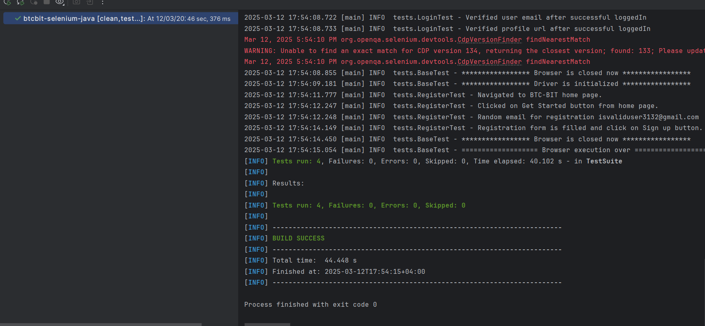
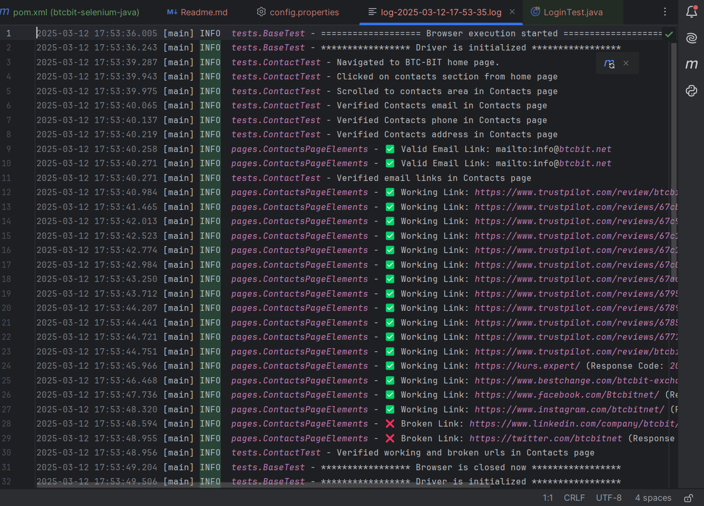
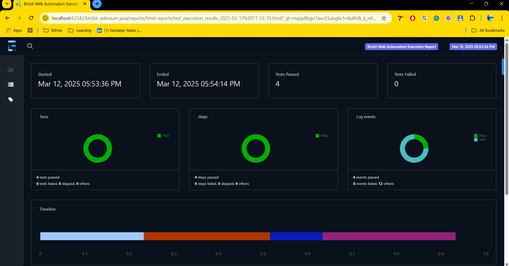
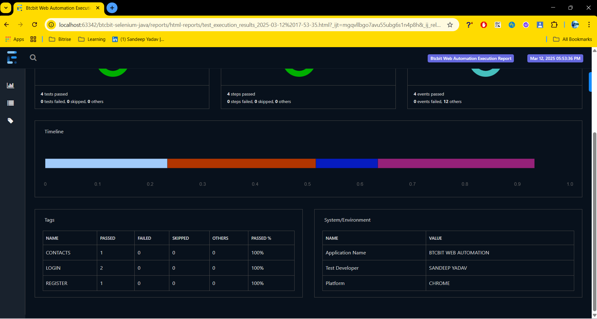

# BTCBIT Web Automation Using Selenium and Java

## Overview

This project automates the testing of a BTCBIT website flows using Selenium and Java. The automation suite verifies various
functionalities, including valid and invalid login test cases, register, contacts page, links and UI element validation.

## Prerequisites for the project

1. Java and set JAVA_HOME
2. Maven and set MAVEN_HOME
3. IDE (preferred: IntelliJ)

## Execution of Test Cases

1. Clone the repository:
   `git clone https://github.com/yadsandy/btcbit-selenium-java-framework.git`

2. cd btcbit-selenium-java-framework

3. If you want to run using terminal use these commands (WINDOWS):
    * To run the test suite for chrome platform

      `mvn clean test -Pchrome`
    * To run the test suite for firefox platform

      `mvn clean test -Pfirefox`
    * To run the test suite for firefox platform

      `mvn clean test -Pedge`

## Execution Result :

Console Output -

Logs -

Extent Report -

Video -
[BTCBIT Automation Video.mp4](BTCBIT%20Automation%20Video.mp4)

